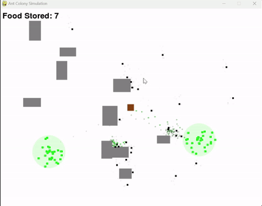
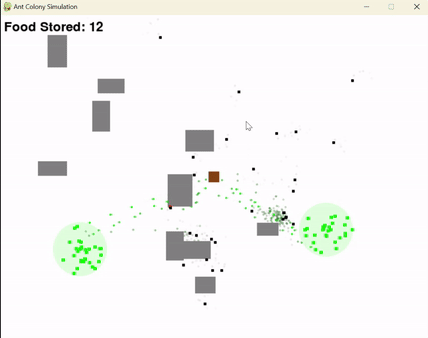
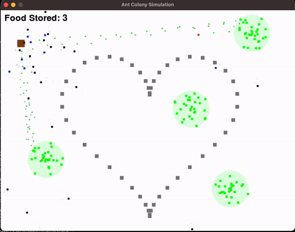
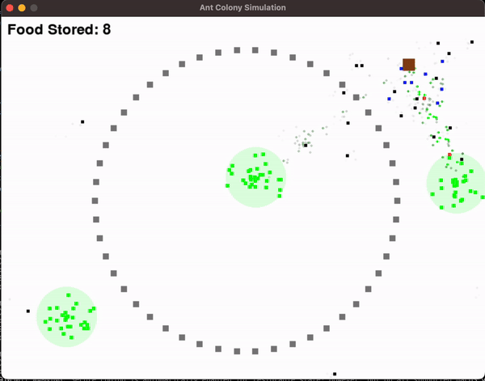
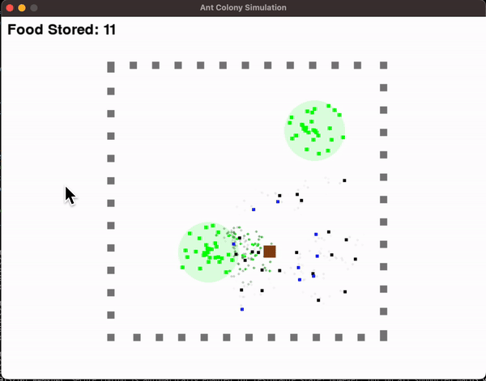
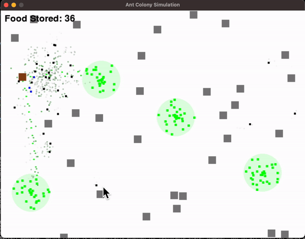

# Ant Simulation

This repository contains an advanced Ant Colony Simulation that demonstrates emergent behavior through pheromone-based pathfinding and collective food gathering.

## Authors and Contributions

### Chia Da Liu
- Obstacle implementation and collision detection
- Ant steering behavior and obstacle avoidance
- Core ant movement mechanics
- Simulation physics and navigation

### Yu Chun Lin
- Food system implementation
- Pheromone tracking mechanism
- Nest functionality and return behavior
- Food counting system
- Right-click food spot creation

### Ting Chia Chen
- Soldier ant implementation and behavior
- Teamwork interaction between worker and soldier ants
- Enhanced soldier ant protection logic
- Game mechanics adjustments for ant behaviors

## Features

### Core Mechanics
- Realistic ant movement with steering behaviors
- Obstacle avoidance system
- Pheromone-based communication
- Food gathering and transportation
- Nest-centered colony behavior

### Ant Types
1. **Worker Ants**:
   - Responsible for foraging food and gathering resources.
   - Exhibit pheromone-following behaviors to lead others to food sources.
   - Carry food back to the nest and deposit it for storage.

2. **Soldier Ants**:
   - Designed to protect the colony and worker ants.
   - Move towards nearby worker ants when they are in danger.
   - Maintain a distance from the nest while ensuring the safety of worker ants during food collection.

## New Obstacle Types

### 1. Heart Shape Obstacle
- A heart-shaped obstacle that creates interesting patterns in the simulation.
- This shape adds a unique visual element and tests the ants' navigation skills.

### 2. Circular Obstacle
- A circular obstacle that provides a smooth barrier for the ants.
- This shape encourages ants to navigate around it rather than directly through it.

### 3. Square Obstacle
- A square-shaped obstacle that represents typical barriers.
- It introduces a standard challenge for ant movement and pathfinding.

### 4. Randomly Placed Obstacles
- Obstacles that are placed at random locations within the simulation area.
- This adds unpredictability to the environment, requiring ants to adapt their strategies.


### Advanced Behaviors
1. **Food Collection System**:
   - Ants search for food sources
   - Food is gathered in concentrated spots
   - Automatic food replenishment
   - Visual feedback when ants carry food

2. **Pheromone System**:
   - Dynamic pheromone trails
   - Strength-based pheromone following
   - Pheromone decay over time
   - Different pheromone types (food and home trails)

3. **Anti-Clustering Mechanisms**:
   - Memory-based movement patterns
   - Stuck detection and resolution
   - Directional persistence
   - Random exploration factors

4.	**Teamwork Behavior:
	•	Soldier ants move to protect worker ants when they are nearby.
	•	Worker ants benefit from soldier protection, ensuring safer food collection.

### Pheromone Coefficients and Behavior Parameters

#### Pheromone Strengths
```python
PHEROMONE_STRENGTHS = {
    'carrying_food': 300,    # Strong trail when carrying food
    'returning_to_food': 200,  # Medium-strong trail when returning to known food
    'experienced': 100,      # Medium trail for experienced ants
    'exploring': 20         # Weak trail during exploration
}
```

#### Movement Parameters
```python
MOVEMENT_WEIGHTS = {
    'wander_force': 0.3,    # Base random movement
    'avoid_force': 2.0,     # Obstacle avoidance priority
    'pheromone_influence': {
        'carrying_food': 2.0,
        'returning': 1.5,
        'exploring': 0.4
    }
}
```

#### Anti-Clustering Parameters
```python
ANTI_CLUSTERING = {
    'memory_length': 30,    # Positions to remember
    'stuck_threshold': 40,  # Distance threshold for stuck detection
    'direction_persistence': {
        'min': 30,
        'max': 60
    }
}


```
## Pheromone Demo Video
<p align="center">
  
</p>

## Add Foods Demo Video
<p align="center">
  
</p>

### Obstacle Shapes

The simulation includes four types of obstacles, each represented in the following GIFs:

1. **Heart-shaped Obstacle**:
   - A unique heart shape that presents a challenge for the ants.

  <p align="center">
  
  </p>

2. **Circular Obstacle**:
   - A circular obstacle that requires strategic navigation.

  <p align="center">
  
  </p>

3. **Square Obstacle**:
   - A square obstacle that blocks paths and affects ant movement.

  <p align="center">
  
  </p>

4. **Randomly Positioned Obstacle**:
   - Obstacles randomly placed throughout the environment.

   <p align="center">
   
   </p>

### Soldier Ant

The soldier ant is a specialized type of ant responsible for protecting worker ants during food collection. Below are the characteristics of the soldier ant:

- **Protection of Worker Ants**: Soldier ants actively approach nearby worker ants to provide protection, ensuring their safety during food gathering.
- **Behavior Demonstration**: Soldier ants patrol around the nest to offer support when needed.

  <p align="center">
  
  </p>

## Installation

### Cloning the Repository
```bash
git clone https://github.com/Yoppman/Ant-Simulation.git
cd Ant-Simulation
```

### Installing Dependencies
Make sure you have Python installed. Install required libraries:
```bash
pip install -r requirements.txt
```

### Requirements
- Python 3.x
- Pygame 2.x

## Running the Program
Launch the simulation:
```bash
python main.py
```

## Controls and Interaction
- **Right Click**: Add new food source
- **Close Window**: Exit simulation
- Food counter displays in top-left corner

## Implementation Details

### Ant States
1. **Exploring**:
   - Higher random movement
   - Lower pheromone influence
   - Active obstacle avoidance

2. **Food Found**:
   - Strong pheromone trail creation
   - Direct path to nest
   - Minimal random movement

3. **Returning to Food**:
   - Medium pheromone following
   - Remembered position influence
   - Moderate random movement

### Pheromone System Details
1. **Trail Creation**:
   - Stronger trails when carrying food
   - Medium strength for return trips
   - Weak trails during exploration
   - Automatic decay over time

2. **Following Behavior**:
   - Weighted influence based on pheromone strength
   - Distance-based effectiveness
   - Random variation to prevent clustering
   - Experience-based following efficiency

3. **Anti-Clustering Mechanics**:
   - Position memory system
   - Stuck detection algorithms
   - Direction persistence
   - Random force injection

## Future Enhancements
- Different ant types (workers, soldiers)
- Multiple food types
- Dynamic obstacle generation
- Weather effects on pheromones
- Colony growth mechanics
- Predator-prey interactions

## Contributing
Feel free to fork the repository and submit pull requests. Areas for improvement include:
- Performance optimization
- New ant behaviors
- UI improvements
- Additional environment features

## License
This project is open source and available under the MIT License.
